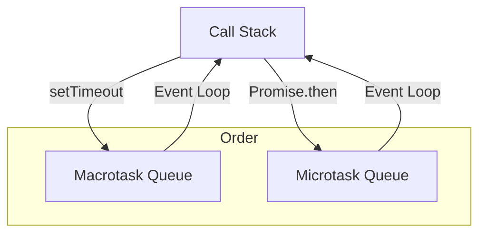

# JavaScript Event Loop Foundations

The JavaScript event loop is a core concept that enables asynchronous programming in JavaScript. Understanding how it works is essential for writing efficient, non-blocking code.

## What is the Event Loop?
JavaScript is single-threaded, meaning it can execute one command at a time. However, it can handle asynchronous operations (like I/O, timers, and network requests) without blocking the main thread. This is possible because of the event loop.

The event loop continuously checks the call stack and the message queue (or task queue). If the call stack is empty, it takes the first message from the queue and pushes it onto the stack, which runs the code.

## Key Components
- **Call Stack:** Where function calls are added and executed.
- **Web APIs:** Browser-provided APIs (like setTimeout, DOM events, AJAX) that handle asynchronous operations.
- **Callback Queue (Task Queue):** Stores callback functions to be executed after the stack is empty.
- **Event Loop:** The mechanism that moves tasks from the queue to the stack.

## How It Works (Step-by-Step)
1. Code runs and function calls are added to the call stack.
2. If an async operation is encountered (e.g., setTimeout), it is handled by Web APIs.
3. Once the async operation completes, its callback is placed in the callback queue.
4. The event loop checks if the call stack is empty. If so, it moves the callback from the queue to the stack for execution.

## Example

## Step-by-Step Visualization: Example with Microtask and Macrotask

Let's visualize the following code:

```js
console.log('Start');
setTimeout(() => {
	console.log('Timeout');
}, 0);
Promise.resolve().then(() => {
	console.log('Promise');
});
console.log('End');
```

### Output:
```
Start
End
Promise
Timeout
```

### Step-by-Step Diagram

#### 1. Initial State
```
Call Stack:    [main()]
Macrotask Queue: []
Microtask Queue: []
```

#### 2. console.log('Start')
```
Call Stack:    [main(), console.log]
Macrotask Queue: []
Microtask Queue: []
```
Output: Start

#### 3. setTimeout scheduled (Macrotask)
```
Call Stack:    [main()]
Macrotask Queue: [setTimeout callback]
Microtask Queue: []
```

#### 4. Promise resolved (Microtask)
```
Call Stack:    [main()]
Macrotask Queue: [setTimeout callback]
Microtask Queue: [Promise callback]
```

#### 5. console.log('End')
```
Call Stack:    [main(), console.log]
Macrotask Queue: [setTimeout callback]
Microtask Queue: [Promise callback]
```
Output: End

#### 6. Main stack empty, process Microtasks
```
Call Stack:    [Promise callback, console.log]
Macrotask Queue: [setTimeout callback]
Microtask Queue: []
```
Output: Promise

#### 7. Microtasks done, process Macrotask
```
Call Stack:    [setTimeout callback, console.log]
Macrotask Queue: []
Microtask Queue: []
```
Output: Timeout

---

### Mermaid Diagram: Event Loop with Microtask and Macrotask



**Order:**
1. Call Stack executes synchronous code
2. Microtasks (Promise) are processed after the stack is empty
3. Macrotasks (setTimeout) are processed after microtasks
## Visualizing the Event Loop

Below are step-by-step diagrams to help you visualize how the event loop works.

### 1. Initial State
```
Call Stack:    [main()]
Web APIs:      []
Callback Queue:[]
```

### 2. setTimeout is called
```
Call Stack:    [main(), setTimeout()]
Web APIs:      [Timer started]
Callback Queue:[]
```

### 3. setTimeout moves to Web APIs
```
Call Stack:    [main()]
Web APIs:      [Timer running]
Callback Queue:[]
```

### 4. Timer completes, callback moves to Callback Queue
```
Call Stack:    [main()]
Web APIs:      []
Callback Queue:[callback]
```

### 5. Call Stack is empty, Event Loop moves callback to Call Stack
```
Call Stack:    [callback]
Web APIs:      []
Callback Queue:[]
```

---

## Why is the Event Loop Important?
- Prevents blocking of the main thread
- Enables non-blocking I/O
- Essential for handling user interactions and network requests efficiently

---

## Further Reading
- [MDN Web Docs: Concurrency model and Event Loop](https://developer.mozilla.org/en-US/docs/Web/JavaScript/EventLoop)
- [JavaScript.info: Event Loop](https://javascript.info/event-loop)
- [Node.js Event Loop Explained](https://nodejs.dev/en/learn/the-nodejs-event-loop/)
- [Philip Roberts: What the heck is the event loop anyway? (JSConf EU)](https://www.youtube.com/watch?v=8aGhZQkoFbQ)
