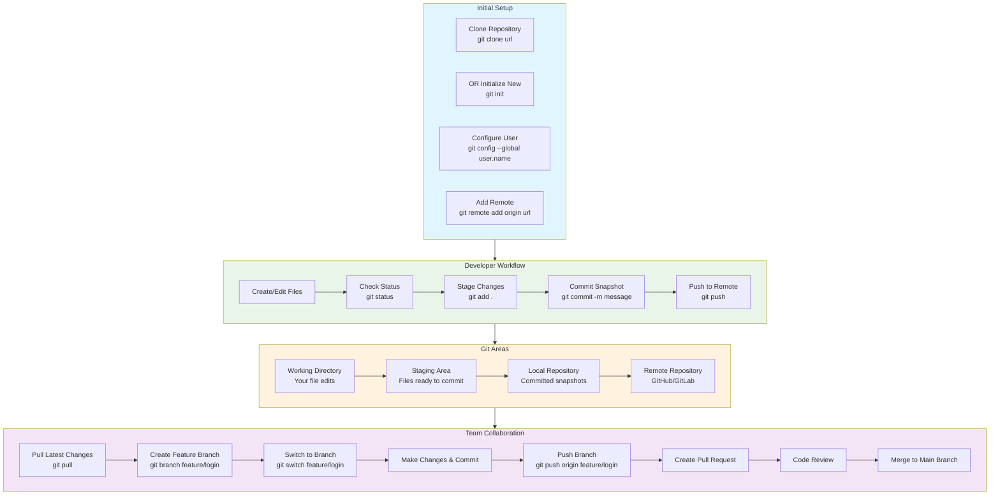

# Git Version Control Workflow

```mermaid
flowchart TD
    subgraph Workspace ["Developer Workflow"]
        A[Create/Edit Files] --> B[Check Status<br/>git status]
        B --> C[Stage Changes<br/>git add .]
        C --> D[Commit Snapshot<br/>git commit -m message]
        D --> E[Push to Remote<br/>git push]
    end
    
    subgraph GitAreas ["Git Areas"]
        F[Working Directory<br/>Your file edits] --> G[Staging Area<br/>Files ready to commit]
        G --> H[Local Repository<br/>Committed snapshots]
        H --> I[Remote Repository<br/>GitHub/GitLab]
    end
    
    subgraph TeamFlow ["Team Collaboration"]
        J[Pull Latest Changes<br/>git pull] --> K[Create Feature Branch<br/>git branch feature/login]
        K --> L[Switch to Branch<br/>git switch feature/login]
        L --> M[Make Changes & Commit]
        M --> N[Push Branch<br/>git push origin feature/login]
        N --> O[Create Pull Request]
        O --> P[Code Review]
        P --> Q[Merge to Main Branch]
    end
    
    subgraph InitSetup ["Initial Setup"]
        R[Clone Repository<br/>git clone url] 
        S[OR Initialize New<br/>git init]
        T[Configure User<br/>git config --global user.name]
        U[Add Remote<br/>git remote add origin url]
    end
    
    Workspace --> GitAreas
    GitAreas --> TeamFlow
    InitSetup --> Workspace
    
    style Workspace fill:#e8f5e8
    style GitAreas fill:#fff3e0
    style TeamFlow fill:#f3e5f5
    style InitSetup fill:#e1f5fe
```
