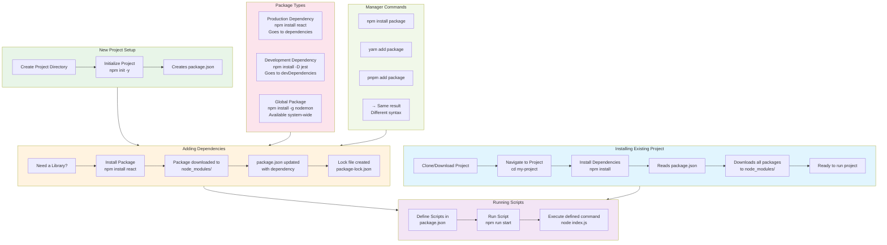

# Package Manager Workflow (npm/yarn/pnpm)

```mermaid
flowchart TD
    subgraph ProjectSetup ["New Project Setup"]
        A[Create Project Directory] --> B[Initialize Project<br/>npm init -y]
        B --> C[Creates package.json]
    end
    
    subgraph DependencyManagement ["Adding Dependencies"]
        D[Need a Library?] --> E[Install Package<br/>npm install react]
        E --> F[Package downloaded to<br/>node_modules/]
        F --> G[package.json updated<br/>with dependency]
        G --> H[Lock file created<br/>package-lock.json]
    end
    
    subgraph ScriptExecution ["Running Scripts"]
        I[Define Scripts in<br/>package.json] --> J[Run Script<br/>npm run start]
        J --> K[Execute defined command<br/>node index.js]
    end
    
    subgraph InstallWorkflow ["Installing Existing Project"]
        L[Clone/Download Project] --> M[Navigate to Project<br/>cd my-project]
        M --> N[Install Dependencies<br/>npm install]
        N --> O[Reads package.json]
        O --> P[Downloads all packages<br/>to node_modules/]
        P --> Q[Ready to run project]
    end
    
    subgraph PackageTypes ["Package Types"]
        R[Production Dependency<br/>npm install react<br/>Goes to dependencies]
        S[Development Dependency<br/>npm install -D jest<br/>Goes to devDependencies]
        T[Global Package<br/>npm install -g nodemon<br/>Available system-wide]
    end
    
    subgraph ManagerComparison ["Manager Commands"]
        U[npm install package] 
        V[yarn add package]
        W[pnpm add package]
        X[→ Same result<br/>Different syntax]
    end
    
    ProjectSetup --> DependencyManagement
    DependencyManagement --> ScriptExecution
    InstallWorkflow --> ScriptExecution
    PackageTypes --> DependencyManagement
    ManagerComparison --> DependencyManagement
    
    style ProjectSetup fill:#e8f5e8
    style DependencyManagement fill:#fff3e0
    style ScriptExecution fill:#f3e5f5
    style InstallWorkflow fill:#e1f5fe
    style PackageTypes fill:#fce4ec
    style ManagerComparison fill:#f1f8e9
```
