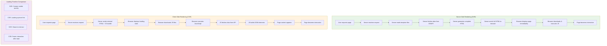

# Server-Side vs Client-Side Rendering Process Flow

```mermaid
flowchart TD
    subgraph SSR ["Server-Side Rendering (SSR)"]
        A1[User requests page] --> B1[Server receives request]
        B1 --> C1[Server reads template files]
        C1 --> D1[Server fetches data from DB/API]
        D1 --> E1[Server generates complete HTML]
        E1 --> F1[Server sends full HTML to browser]
        F1 --> G1[Browser displays page immediately]
        G1 --> H1[Browser downloads & executes JS]
        H1 --> I1[Page becomes interactive]
    end

    subgraph CSR ["Client-Side Rendering (CSR)"]
        A2[User requests page] --> B2[Server receives request]
        B2 --> C2[Server sends minimal HTML + JS bundle]
        C2 --> D2[Browser displays loading state]
        D2 --> E2[Browser downloads JS files]
        E2 --> F2[Browser executes JavaScript]
        F2 --> G2[JS fetches data from API]
        G2 --> H2[JS builds DOM elements]
        H2 --> I2[Page content appears]
        I2 --> J2[Page becomes interactive]
    end

    subgraph Timeline ["Loading Timeline Comparison"]
        T1[SSR: Content visible quickly] 
        T2[CSR: Loading spinner first]
        T3[SSR: Slower to interact]
        T4[CSR: Faster interaction after load]
    end
    
    style SSR fill:#e8f5e8
    style CSR fill:#fff3e0
    style Timeline fill:#f3e5f5
```
