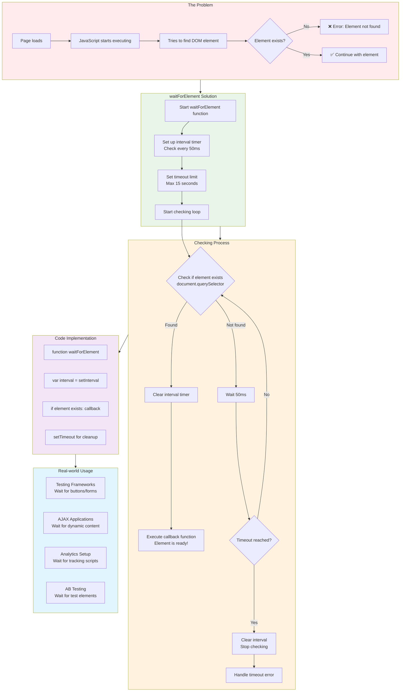

# waitForElement Function Process Flow

```mermaid
flowchart TD
    subgraph Problem ["The Problem"]
        A[Page loads] --> B[JavaScript starts executing]
        B --> C[Tries to find DOM element]
        C --> D{Element exists?}
        D -->|No| E[❌ Error: Element not found]
        D -->|Yes| F[✅ Continue with element]
    end
    
    subgraph Solution ["waitForElement Solution"]
        G[Start waitForElement function] --> H[Set up interval timer<br/>Check every 50ms]
        H --> I[Set timeout limit<br/>Max 15 seconds]
        I --> J[Start checking loop]
    end
    
    subgraph CheckingLoop ["Checking Process"]
        J --> K{Check if element exists<br/>document.querySelector}
        K -->|Found| L[Clear interval timer]
        L --> M[Execute callback function<br/>Element is ready!]
        K -->|Not found| N[Wait 50ms]
        N --> O{Timeout reached?}
        O -->|No| K
        O -->|Yes| P[Clear interval<br/>Stop checking]
        P --> Q[Handle timeout error]
    end
    
    subgraph Implementation ["Code Implementation"]
        R[function waitForElement]
        S[var interval = setInterval]
        T[if element exists: callback]
        U[setTimeout for cleanup]
    end
    
    subgraph RealWorld ["Real-world Usage"]
        V[Testing Frameworks<br/>Wait for buttons/forms]
        W[AJAX Applications<br/>Wait for dynamic content]
        X[Analytics Setup<br/>Wait for tracking scripts]
        Y[AB Testing<br/>Wait for test elements]
    end
    
    Problem --> Solution
    Solution --> CheckingLoop
    CheckingLoop --> Implementation
    Implementation --> RealWorld
    
    style Problem fill:#ffebee
    style Solution fill:#e8f5e8
    style CheckingLoop fill:#fff3e0
    style Implementation fill:#f3e5f5
    style RealWorld fill:#e1f5fe
```
